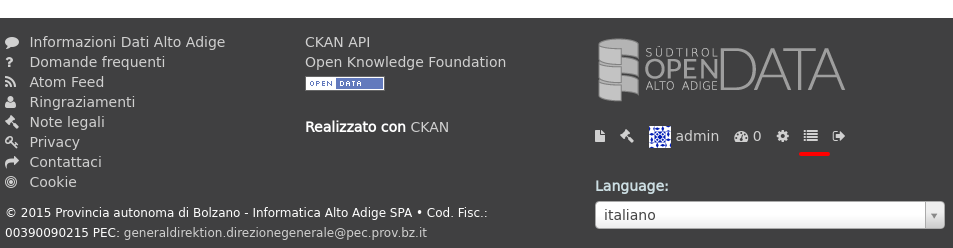
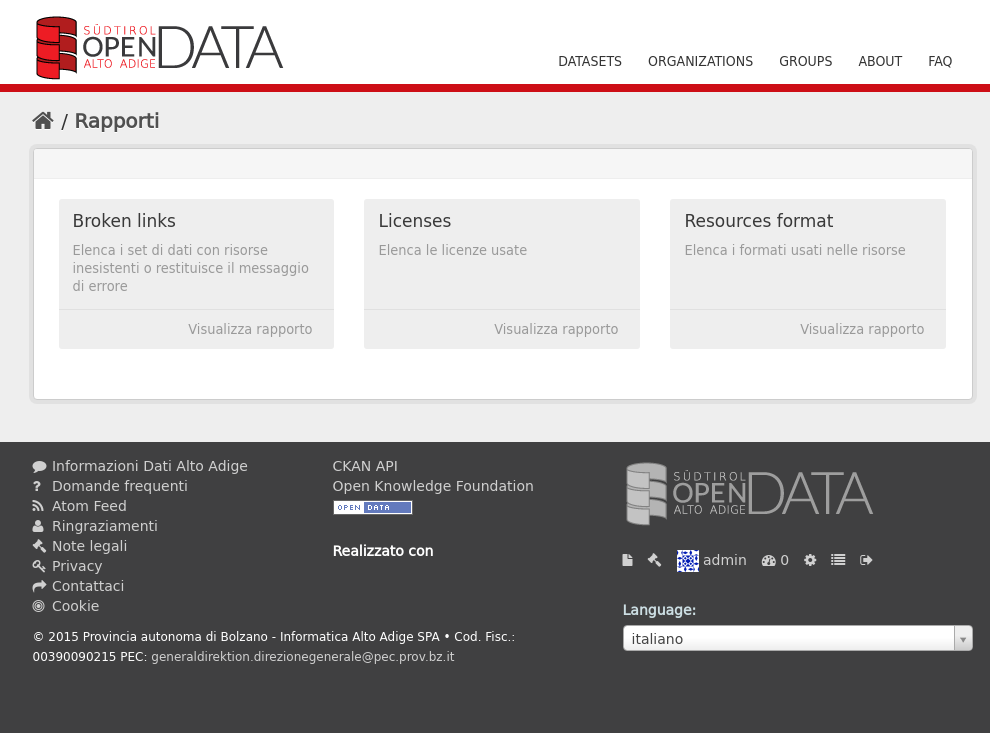
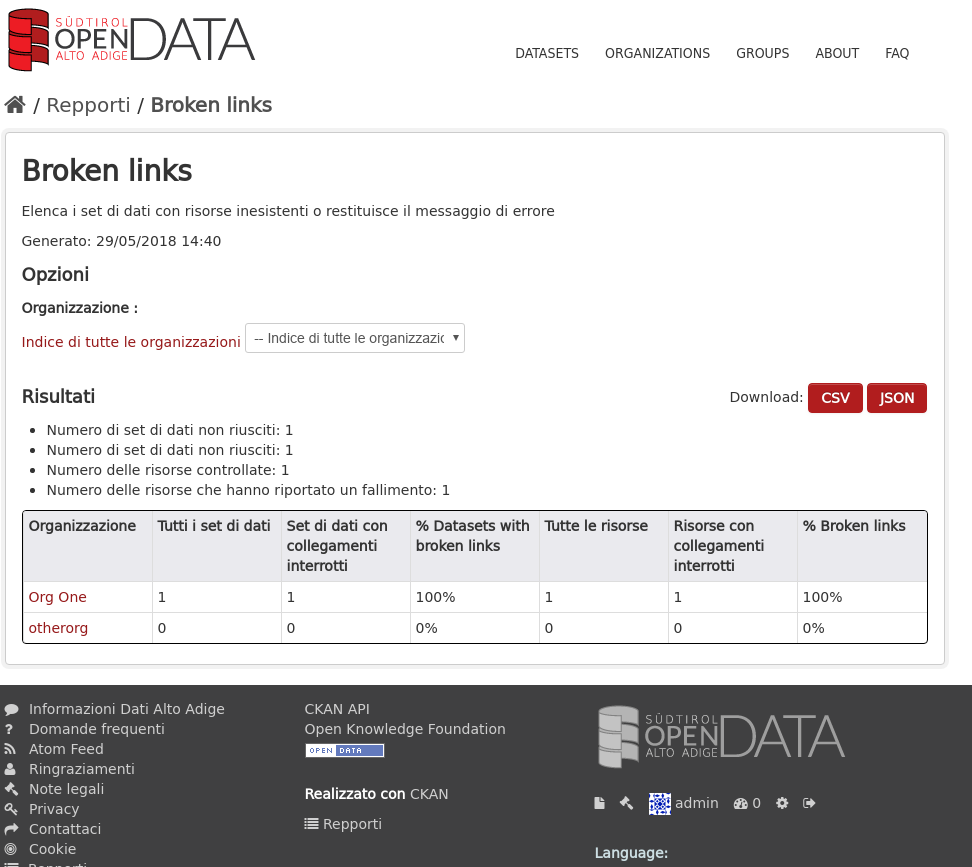
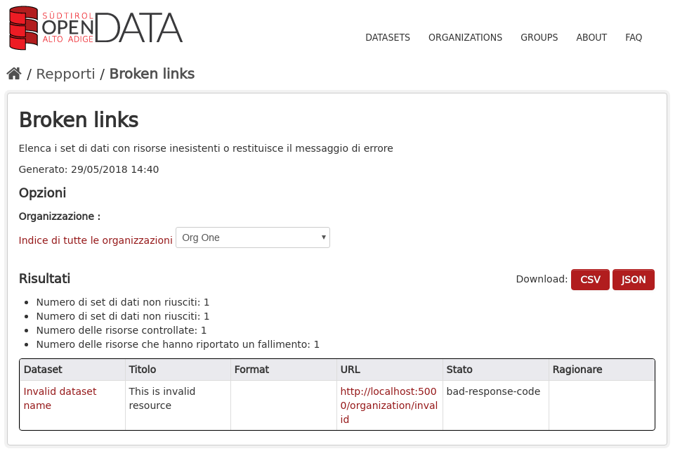
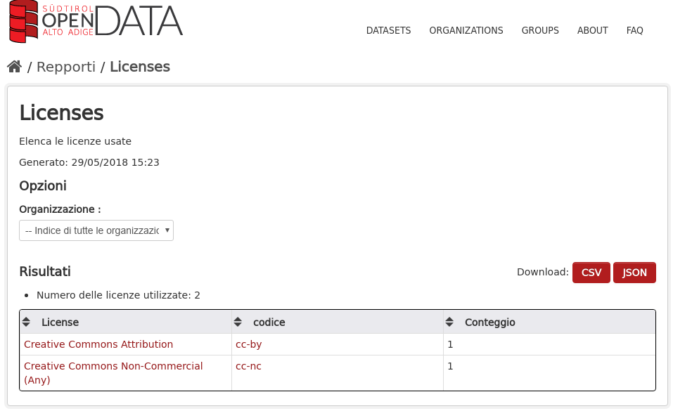
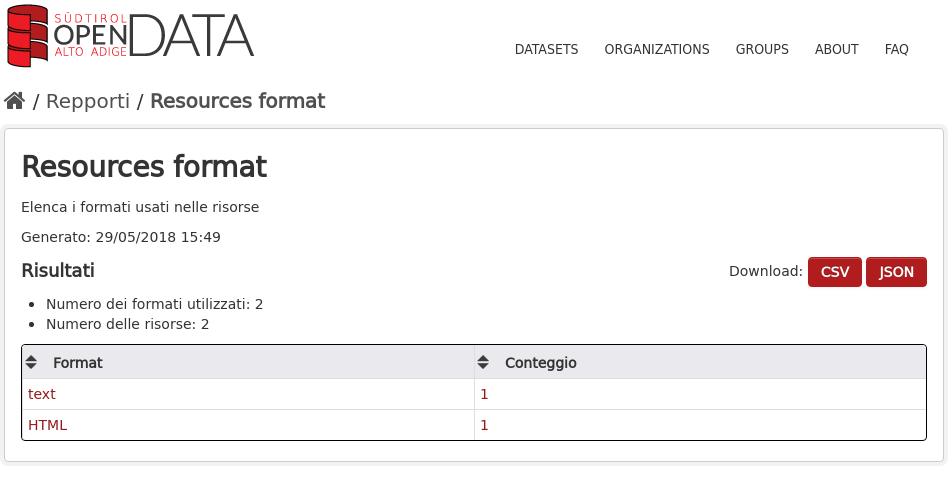

.. _install_ckan_other:

#####################
Other CKAN extensions
#####################

============
Introduction
============

In this document you'll only find specific information for installing some CKAN official and
unofficial extensions.

.. _extension_provbz:

==============================
Provincia Di Bolzano Extension
==============================

The ckanext-provbz CKAN's extension provides some customizations for the CKAN Look and Feel and other.
In addition this extension provides an harvester that merge functionalities between two other 
harvesters built on the ckanext-spatial extension like:

- https://github.com/geosolutions-it/ckanext-multilang
- https://github.com/geosolutions-it/ckanext-geonetwork

------------
Requirements
------------

The ckanext-provbz extension has been developed for CKAN 2.4.
Other extensions needed as dependencies are:

- https://github.com/geosolutions-it/ckanext-multilang
- https://github.com/geosolutions-it/ckanext-geonetwork
- https://github.com/geosolutions-it/ckanext-pages

------------------------
Development Installation
------------------------

To install ckanext-provbz:

1. Activate your CKAN virtual environment, for example::

     . /usr/lib/ckan/default/bin/activate

2. Go into your CKAN path for extension (like /usr/lib/ckan/default/src)

3. git clone https://github.com/geosolutions-it/ckanext-provbz

4. cd ckanext-provbz

5. python setup.py install

6. Initilize the provbz additional DB table for custom metadata fields::

	paster --plugin=ckanext-provbz provbzdb initdb --config=/etc/ckan/default/production.ini

7. Add ``provbz_theme``  and ``provbz_harvester`` to the ``ckan.plugins`` setting in your CKAN
   config file (by default the config file is located at
   ``/etc/ckan/default/production.ini``).

8. The ckanext-provbz extension provides some updates for the i18n files for 'it' and 'de' languages. 
   Locale files in CKAN (.mo and .po) for these languages must be replaced with files located in this 
   extension at the ckanext-provbz/ckanext/provbz/i18n/ path.

9. Update the production.ini configuration finding the default property ``licenses_group_url`` and change the value::

	licenses_group_url = file:///usr/lib/ckan/default/src/ckanext-provbz/ckanext/provbz/licenses/ckan.json

10. Update the production.ini configuration finding the default property ``i18n_directory`` and change the value::

	ckan.i18n_directory = /usr/lib/ckan/default/src/ckanext-provbz/ckanext/provbz/translations

11. Restart CKAN.

====================
GeoNetwork harvester
====================

The GeoNetwork harvester extends the base CSW harvester type, adding some features
as explained in :ref:`ckan_harvesting`, such as:

* handling the ``default_tags`` and ``default_extras`` parameters;
* adding a couple of ``extras`` entries which contain URLs to GeoNetwork info.

------------
Requirements
------------

The ckanext-multilang extension has been developed for CKAN 2.2 or later.
Other extensions needed as dependencies are:

- https://github.com/geosolutions-it/ckanext-spatial

------------
Installation
------------

In order to install the extension, log in as user ``ckan``, activate the virtual env and check out the extension::

   . /usr/lib/ckan/default/bin/activate
   cd default/src/
   git clone https://github.com/geosolutions-it/ckanext-geonetwork.git
   cd ckanext-geonetwork
   python setup.py install

Add plugin in ``/etc/ckan/default/production.ini``::

   ckan.plugins = [...] geonetwork_harvester

Restart supervisord::

   systemctl stop supervisord
   systemctl start supervisord

===================
Multilang Extension
===================

The ckanext-multilang CKAN's extension provides a way to localize your CKAN's title and description contents for: 
Dataset, Resources, Organizations and Groups. This extension creates some new DB tables for this purpose containing 
localized contents in base of the configured CKAN's locales in configuration (the production.ini file). So, accessing 
the CKAN's GUI in 'en', for example, the User can create a new Dataset and automatically new localized records for that 
language will be created in the multilang tables. In the same way, changing the GUI's language, from the CKAN's language 
dropdown, the User will be able to edit again the same Dataset in order to specify 'title' and 'description' of the Dataset 
for the new selected language. In this way Dataset's title and description will automatically changed simply switching the 
language from the CKAN's dropdonw.

------------
Requirements
------------

The ckanext-multilang extension has been developed for CKAN 2.4.
Other extensions needed as dependencies are:

- https://github.com/geosolutions-it/ckanext-spatial

.. warning:: The ckanext-multilang provides also an harvester built on the ckanext-spatial extension, and inherits all of its functionalities. Currently a forked branch of the stable ckanext-spatial extension is used in order to allow an after import stage functionality (used for the ckanext-multilang persistence):

			 https://github.com/geosolutions-it/ckanext-spatial/tree/stable_official_after_imp_st
			 
			 Installing the ckanext-multilang extension make sure to use this fork and branch of the ckanext-spatial. The update will be ported on the official branch as soon as possible.

------------
Installation
------------

In order to install the extension, log in as user ``ckan``, activate the virtual env and check out the extension::

1. Activate your CKAN virtual environment, for example::

	. /usr/lib/ckan/default/bin/activate

2. Go into your CKAN path for extension (like /usr/lib/ckan/default/src)

3. git clone https://github.com/geosolutions-it/ckanext-multilang.git

4. cd ckanext-multilang

5. python setup.py install

6. Initilize the multilang tables::

	paster --plugin=ckanext-multilang multilangdb initdb --config=/etc/ckan/default/production.ini

7. Add ``multilang`` and ``multilang_harvester`` to the ``ckan.plugins`` setting in your CKAN
   config file (by default the config file is located at
   ``/etc/ckan/default/production.ini``).
   
8. Update the Solr schema.xml file used by CKAN (located at /etc/solr/ckan/conf/) introducing the following elements:
   
   Inside the 'fields' Tag::
   
		<dynamicField name="multilang_localized_*" type="text" indexed="true" stored="true" multiValued="false"/>
   
   as first 'dynamicField'
   
   A new 'copyField' to append::
   
		<copyField source="multilang_localized_*" dest="text"/>

9. Restart Solr.

10. Restart CKAN.

.. warning:: Make sure that the final order of the plugins list into the CKAN's configuration (production.ini file) is the folowing:: 

	ckan.plugins = shibboleth datastore harvest ckan_harvester provbz_theme spatial_metadata spatial_query csw_harvester geonetwork_harvester stats text_view image_view recline_view multilang multilang_harvester provbz_harvester

.. _extension_pages:

===============
Pages Extension
===============

This extension gives you an easy way to add simple pages to CKAN.

------------
Requirements
------------

The ckanext-pages extension has been developed for CKAN 2.3 or later.

------------
Installation
------------

Activate your CKAN virtual environment::

   . /usr/lib/ckan/default/bin/activate

Go into your CKAN path for extension::

   cd /usr/lib/ckan/default/src

Import the project from the github repository and install it::

   git clone https://github.com/geosolutions-it/ckanext-pages.git
   cd ckanext-pages
   git checkout multilang
   python setup.py install

Configure the extension in the CKAN's configuration file::
	
	vim /etc/ckan/default/production.ini

Add the following configuration lines::

	# Ckan Pages config options
	ckanext.pages.allow_html = True
	ckanext.pages.editor = ckeditor

Enable the plugin by appending the name of the extension to the plugin property::

	ckan.plugins = ... pages
	
Finally restart CKAN.

====================
Shibboleth Extension
====================

The Shibboleth plugin will allow users to log in into CKAN using an existing Shibboleh environment.  

.. hint:: The CKAN shibboleth plugin repository is at http://github.com/geosolutions-it/ckanext-shibboleth

------------
Installation
------------

Activate your CKAN virtual environment::

   . /usr/lib/ckan/default/bin/activate

Go into your CKAN path for extension::

   cd /usr/lib/ckan/default/src

Import the project from the github repository and install it::

   git clone https://github.com/geosolutions-it/ckanext-shibboleth.git
   cd ckanext-shibboleth
   python setup.py install
        
--------------------	
Plugin configuration
--------------------

You have to configure the shibboleth plugin.
There are a couple of configuration files to edit:

``/etc/ckan/default/production.ini``

   - Tells CKAN to load the shibboleth plugin
    
``/etc/ckan/default/who.ini``

   - Tells the auth framework to use the shibboleth plugin for authentication.
   - Tells the shibboleh plugin how to retrieve the info about the authenticated user.  

``production.ini`` configuration
^^^^^^^^^^^^^^^^^^^^^^^^^^^^^^^^

Edit the file ``/etc/ckan/default/production.ini`` and append ``shibboleth`` to the ``ckan.plugins`` line::

     ckan.plugins = [...] shibboleth
    

``who.ini`` configuration
^^^^^^^^^^^^^^^^^^^^^^^^^

Inside the directory ``/etc/ckan/default/`` we created the symbolic link ``who.ini`` 
linking the file ``/usr/lib/ckan/default/src/ckan/who.ini``.
We need to edit this file to configure some info for the shibboleth integration.
We don't want to modifiy the original file so we'll have to:

- Rename the symbolic link so we still have a reference to the original file::

   mv /etc/ckan/default/who.ini /etc/ckan/default/orig.who.ini
   
- Create a new file copy to edit::   

   cp /usr/lib/ckan/default/src/ckan/who.ini /etc/ckan/default/shibboleth.who.ini
    
- Create a symlink, so you may easily switch back to the original configuration should you need to::

   ln -s /etc/ckan/default/shibboleth.who.ini /etc/ckan/default/who.ini
 
Now let's edit the ``/etc/ckan/default/shibboleth.who.ini`` file.

Add the ``plugin:shibboleth`` section, customizing the env var names::

   [plugin:shibboleth]
   use = ckanext.shibboleth.repoze.ident:make_identification_plugin
   
   session = HTTP_SHIB_SESSION_ID
   eppn = HTTP_UID
   mail = NO_MAIL_HEADER
   fullname = HTTP_SN
   
   check_auth_key=HTTP_SHIB_AUTHENTICATION_METHOD
   check_auth_value=urn:oasis:names:tc:SAML:2.0:ac:classes:PasswordProtectedTransport
 
- ``session`` is used to identify the session id read by the shibboleth integration;
- ``eppn`` is the identifier used to uniquely identify the user;
- ``mail`` is the user mail address. You may set it to a name that will not be resolved; the user's mail address will be left blank, 
  and the user will be reminded about this at every login;
- ``fullname`` is the string used as the username in CKAN, displayed on the UI;
- ``check_auth_key`` and ``check_auth_value`` are needed to find out if we are properly receiving info from the Shibboleth module.

Add ``shibboleth`` to the list of the identifier plugins::

    [identifiers]
    plugins =
        shibboleth
        friendlyform;browser
        auth_tkt

Add ``ckanext.shibboleth.repoze.auth:ShibbolethAuthenticator`` to the list of the authenticator plugins::

    [authenticators]
    plugins =
        auth_tkt
        ckan.lib.authenticator:UsernamePasswordAuthenticator
        ckanext.shibboleth.repoze.auth:ShibbolethAuthenticator

Add ``shibboleth`` to the list of the challengers plugins::

    [challengers]
    plugins =
        shibboleth
    #    friendlyform;browser
    #   basicauth

Apache HTTPD configuration
^^^^^^^^^^^^^^^^^^^^^^^^^^

The ckanext-shibboleth extension requires that the ``/shibboleth`` path to be externally filtered by the shibboleth
client module.

Using ``mod_shib`` on your apache httpd installation, you need these lines in your configuration file::

    <Location ~ /shibboleth >
        AuthType shibboleth
        ShibRequireSession On
        require valid-user
    </Location>

:download:`This is the complete ckan.conf configuration file <resources/92_ckan.conf>` you can use as a reference.

CKAN locales configuration
^^^^^^^^^^^^^^^^^^^^^^^^^^

The ckanext-shibboleth extension defines some own locale strings defined into the internal .mo and .po files at ``ckanext-shibboleth/ckanext/shibboleth/i18n/``.
As reported above, for the ckanext-provbz installation steps, at this point you have already updated the default CKAN's locale files. So the locales information of the 
ckanext-shibboleth extension should be just appended to the existing ones ('it' and 'de') in CKAN as described below:

1 - Open the file::

	ckanext-shibboleth/ckanext/shibboleth/i18n/it/LC_MESSAGES/ckanext-shibboleth.po

2 - Copy the content reported below::

	#: ckanext/repoze/who/shibboleth/controller.py:25
	msgid "No user info received for login"
	msgstr "Non sono state ricevute informazioni sull'utente"

	#: ckanext/repoze/who/shibboleth/templates/user/snippets/login_form.html:25
	msgid "Shibboleth"
	msgstr "Shibboleth"

	#: ckanext/repoze/who/shibboleth/templates/user/snippets/login_form.html:26
	msgid "Login through Shibboleth."
	msgstr "Accedi attraverso Shibboleth"

	#: ckanext/repoze/who/shibboleth/templates/user/snippets/login_form.html:33
	msgid "Login via Shibboleth"
	msgstr "Accedi attraverso Shibboleth"

	#: ckanext/repoze/who/shibboleth/templates/user/snippets/login_form.html:45
	msgid "Authentication by using local account"
	msgstr "Autenticazione con account locale"

	#: ckanext/repoze/who/shibboleth/templates/user/snippets/login_form.html:49
	msgid "Username"
	msgstr "Nome utente"

	#: ckanext/repoze/who/shibboleth/templates/user/snippets/login_form.html:50
	msgid "Password"
	msgstr "Password"

	#: ckanext/repoze/who/shibboleth/templates/user/snippets/login_form.html:59
	msgid "Log in"
	msgstr "Accedi"
	
3 - Append it at the end of the CKAN's related file for 'it'::

	ckan/ckan/i18n/it/LC_MESSAGES/ckan.po

4 - Rebuild the ckan.mo file with the updated content using the following command::

	cd /usr/lib/ckan/default/src/ckan
	. /usr/lib/ckan/default/bin/activate
	
	python setup.py compile_catalog --locale it
	
5 - Repete the steps above for the 'de' locales and finally restart CKAN.
	

.. _ckanext-gsreports-extension:

=================
Reports extension
=================

`ckanext-gsreports` provides aggregated information about:

 * resources formats used,
 * license types used
 * resources which links to errorous or invalid urls.

This extension uses `ckanext-reports`. Reports are generated periodically, and be visible to admin users.

------------
Installation
------------

This extension requires `ckanext-report` and `owslib` to be installed prior to using `ckanext-gsreport`.

1. Install `ckanext-report` and init db::

    $ git clone https://github.com/datagovuk/ckanext-report.git
    $ cd ckanext-report
    $ pip install -e .
    $ paster --plugin=ckanext-report report initdb --config=path/to/config.ini

2. Clone repository and install package::

    $ git clone https://github.com/geosolutions-it/ckanext-gsreport.git
    $ cd ckanext-gsreport
    $ pip install -r requirements.txt
    $ pip install -e .

3. Add `status_reports` to plugins. **Note** Order of entries matters. This plugin should be placed **before** `report` plugin.::

    ckan.plugins = .. status_reports report

4. Restart CKAN

5. Run solr data reindexing (license and resource format reports are using special placeholders in solr to access data without value)::

    paster --plugin=ckan search-index rebuild_fast -c /path/to/config.ini

6. Run reports generation (see the section below)

.. ckanext-gsreports-usage:

-------------
Configuration
-------------

Reports module has following configuration options:

 * `ckanext.gsreport.resource_format.format_limit` - this option controls how many resources are shown in per-format view of `resources-format` report (default: 100). This should speed-up rendering of this report page, because in most popular formats, there can be tens of thousands of resources with that format. However, if you select specific organization, you should see all resources for that organization and selected format.

-----
Usage
-----

Generating reports
^^^^^^^^^^^^^^^^^^

Report can be generated in two ways:

1. From CLI (this can be used to set up cron job):

- generate all reports::

   $ paster --plugin=ckanext-report report generate --config=path/to/config.ini

- generate one report::

   $ paster --plugin=ckanext-report report generate $report-name --config=path/to/config.ini

2. in UI, by opening `/report` url when user opens report page for the first time (with no data in report)

.. warning::

   Report generation can take a while to produce results. Especially `broken-links` report may take significant amount of time, because it will check each resource for availability.

.. note::

   Report generation speed depends on network speed, response time from resources and number of resources to check. That is why it's recommended to run reports generation outside web process, for example with cron.

Usage
^^^^^

Main reports view is available for admin users only. User can access it with `/reports` path, or accessing **Reports** link in the footer:

Main view
+++++++++

Main view shows list of reports available:

Broken links report view
++++++++++++++++++++++++

Broken links report view will show list of organizations with number of all datasets and datasets with broken links:

User can filter list by organization, either by selecting one from dropdown, or clicking one in in table. After selecting organization, list of broken links is more detailed, with list of actual resources, grouped by dataset. List contains links to resource, dataset and information of type of error (including response if possible).

Licenses report view
++++++++++++++++++++

Licenses report view will show types of license and number of datasets using that license. This report will show only public datasets.

License names will link to search page which will show datasets using specific license.

Resource type report view
+++++++++++++++++++++++++

Resource type report will show types of formats of resources.

Format name links to detailed report with all resources are using that format. Additionally, detailed report can be filtered by organization.

.. note::

    This view can contain large number of data, and because of that take significant amount of time to render. In order to avoid timeouts and see results quicker, you should set `ckanext.gsreport.resource_format.format_limit` value in your config. 

.. image:: ../images/reports/reports-view-resource-type-type.png

Exporting data
++++++++++++++

Each report can be exported to either CSV or JSON format. 

.. note::

    Exported data may contain more data than showed in report view.

.. note::

    Data export will return data only for current view, so, for example if report view shows data filtered by organization, export will also retun data filtered for specific organization only.
	

Setting the Cron Job to generate report periodically
++++++++++++++++++++++++++++++++++++++++++++++++++++

#. Create a script for running your report generation
 
   Create a script ``/usr/lib/ckan/run_gsreports.sh`` (in the same file system location of the harvester one see also :ref:`ckanext_harvesting`) with this content::  

      . /usr/lib/ckan/default/bin/activate 
      paster --plugin=ckanext-report report generate $@ --config=/etc/ckan/default/production.ini
      
   and make it executable ::
   
      chmod +x /usr/lib/ckan/run_gsreports.sh         

#. Tell cron to run your script

   Now we have to tell cron to run the script every day at 2 A.M.
   Open the crontab in editing mode with ``crontab -e`` and add the line ::

      0 2 * * * /usr/lib/ckan/run_gsreport.sh &> /usr/lib/ckan/gsreport.log
	
	
.. _ckanext_extras_extension:

================
Extras extension
================

The ckanext-extras CKAN's extension provides `external_resource_list` action, which returns list of public resources, which are not local (are served by external service).

------------
Installation
------------

Installing all the other extensions required

1. Activate your CKAN virtual environment, for example:

.. code::

    . /usr/lib/ckan/default/bin/activate

2. Go into your CKAN path for extension (like /usr/lib/ckan/default/src):

.. code::

    git clone https://github.com/geosolutions-it/ckanext-extras.git
    cd ckanext-extras
    pip install -e .

3. Add `external_resource_list` to the `ckan.plugins` setting in your CKAN config file (by default the config file is located at `/etc/ckan/default/production.ini`).

4. Restart CKAN.

-------------
Configuration
-------------

This extension uses `ckan.site_url` value to resolve if url is external. If url starts with local site value, it will be considered as local.

However, it may came to situation, that single site url is insufficient. For that case, you can add `ckanext.extras.local_sites` to config. This can be a string or list of strings with base urls, which should be considered as local.

Additionally, urls that starts with values from local sites, may be actually external (proxied from external sites). In that case, you can also set `ckanext.extras.external_sites`

To establish if url is external in such scenario, url will be checked with external sites first (if url starts with external site prefix, it will be considered external at this point), then with local sites (if url starts with local site prefix, it will be considered local). If none of those checks will provide result, url will eventually be considered as external.

Example
^^^^^^^

Sample configuration:

.. code::

    ckan.site_url = http://public.address

    ckanext.extras.local_sites =
        http://localhost
        http://127.0.0.1

    ckanext.extras.external_sites = 
        http://localhost/proxied
        http://public.address/remote/

.. csv-table::
  :header: "Url","Is external?"

  `http://public.address/index`,No
  `http://public.address/remote/index`,Yes
  `http://localhost/resource/001`,No
  `http://localhost/proxied/resource/001`,Yes

-----------------------------
Accessing external links list
-----------------------------

External resources list is available through api, under `api/action/external_resource_list` endpoint

Sample response:

.. code:: json

    {"help": "http://localhost:5000/api/3/action/help_show?name=external_resource_list",
    "success": true,
    "result": {"count": 1,
               "data": [{"url": "https://ckan.org/documentation-and-api/", 
                         "id": "5e26f241-d3f9-4f48-b342-03e3364ca16f",
                         "name": "Documentation",
                         "dataset": 
                            {"url": "http://localhost:5000/dataset/ed66af9c-d8ee-4dd5-8a05-acbfc760a323",
                             "id": "ed66af9c-d8ee-4dd5-8a05-acbfc760a323",
                             "title": "Licensed dataset"}}],
    "limit": 50, "offset": 0}}

External resource list accepts two params:

 * `limit` - number of items returned on a page
 * `offset` - offset in list, calculated from item at index 0.

.. _extension_datapusher:
 
==========
DataPusher
==========

Automatically add Data to the CKAN DataStore.

.. hint::
   Doc page at http://docs.ckan.org/projects/datapusher/en/latest/index.html

As ``root`` install the WSGI apache module:: 

   yum install mod_wsgi

As ``ckan``, create a brand new virtualenv, and install the datapusher app in it:: 

   virtualenv /usr/lib/ckan/datapusher
   mkdir /usr/lib/ckan/datapusher/src
   cd /usr/lib/ckan/datapusher/src
   git clone -b stable https://github.com/ckan/datapusher.git
   cd datapusher/
   . ../../bin/activate
   pip install -r requirements.txt
   python setup.py develop

Create configuration files::

    cp /usr/lib/ckan/datapusher/src/datapusher/deployment/datapusher_settings.py /etc/ckan/default/datapusher_settings.py
     
    cp /usr/lib/ckan/datapusher/src/datapusher/deployment/datapusher.wsgi /etc/ckan/default/datapusher.wsgi
    
Then edit ``/etc/ckan/default/datapusher.wsgi`` and adjust the settings path from::  

    os.environ['JOB_CONFIG'] = '/etc/ckan/datapusher_settings.py'
    
to ::

    os.environ['JOB_CONFIG'] = '/etc/ckan/default/datapusher_settings.py'

Then create a file name ``/etc/httpd/conf.d/94-datapusher.conf`` and add these lines::

    Listen 8800
   
    <VirtualHost 0.0.0.0:8800>
   
       ServerName ckan
   
       # this is our app
       WSGIScriptAlias / /etc/ckan/default/datapusher.wsgi
   
       # pass authorization info on (needed for rest api)
       WSGIPassAuthorization On
   
       # Deploy as a daemon (avoids conflicts between CKAN instances)
       WSGIDaemonProcess datapusher display-name=demo processes=1 threads=15
   
       WSGIProcessGroup datapusher
   
       ErrorLog /var/log/httpd/datapusher.error.log
       CustomLog /var/log/httpd/datapusher.log combined
   
       <Directory "/" >
          Require all granted
       </Directory>
   
    </VirtualHost>

Now let's allow connections to port 8800 in SELinux::  

   semanage port -a -t http_port_t -p tcp 8800
    
and restart httpd in order to load the new configuration::

   systemctl restart httpd

Test the datapusher entrypoint with a request like ::

    curl http://localhost:8800
    
on the same machine ckan is running on.  
You should get a response like this::

   {
     "help": "\n        Get help at:\n        http://ckan-service-provider.readthedocs.org/."
   }

   
Now let's make ckan aware that the datapusher is available.

Edit the file ``/etc/ckan/default/production.ini`` and: 

- add the ``datapusher`` plugin::

     ckan.plugins = [... other plugins...] datapusher
 
- remove the comments from the lines::

     ckan.datapusher.formats = csv xls xlsx tsv application/csv application/vnd.ms-excel application/vnd.openxmlformats-officedocument.spreadsheetml.sheet
     ckan.datapusher.url = http://127.0.0.1:8800/
     
Eventually restart supervisord to make ckan reload the configuration::

     systemctl restart supervisord

==================
Document changelog
==================

+---------+------+--------+---------------------------------------+
| Version | Date | Author | Notes                                 |
+=========+======+========+=======================================+
| 1.0     |      |        | Initial revision                      |
+---------+------+--------+---------------------------------------+
| 1.1     |      |        | Improve doc for installing shibboleth |
+---------+------+--------+---------------------------------------+
| 1.2     | 2018 | CS     | Updated information on additional     |
|         | 05-25|        | extensions                            |
+---------+------+--------+---------------------------------------+
